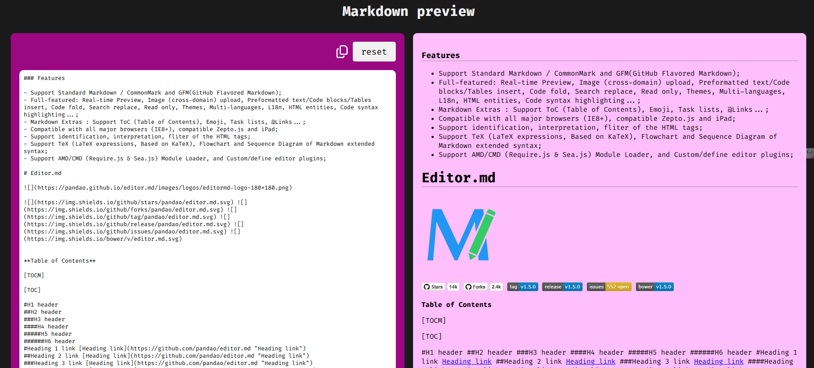
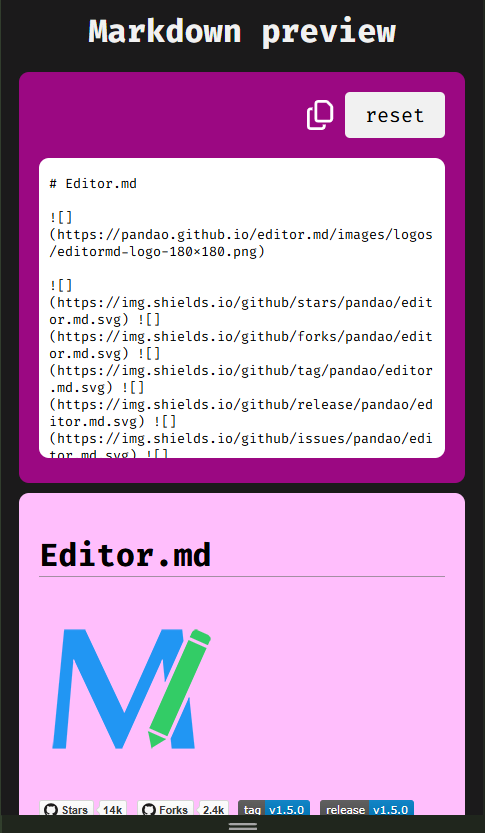

# Markdown Previewer

A simple web application that allows users to write Markdown text and see the live preview of the rendered HTML in real-time. The application uses **JavaScript** and **marked.js** to render Markdown.

## Features

- **Real-time Markdown preview**: As users type Markdown text, the preview is updated live.
- **Responsive design**: The application adapts to different screen sizes, with special adjustments for mobile and tablet views.
- A clear/reset button to clear the textarea


### Additional Features:
- **Copy to clipboard**: You can easily copy the rendered Markdown text.
- **Local Storage Support**: Your Markdown text is saved in the browser's local storage, so it persists even after refreshing or closing the browser.


## Screenshots

Here are some screenshots of the application in use:

### Screenshot 1: Desktop View


### Screenshot 2: Mobile View


## Technologies Used

- **HTML**: Markup for the structure.
- **CSS**: Styling for the layout and design.
- **JavaScript**: Logic to handle Markdown rendering with the help of the **marked.js** library.
- **marked.js**: A lightweight Markdown parser and compiler.


## Deployment

You can try the app live here:

[Live Demo](https://api.dipkumarpal.me/small-project/markdown-previewer/)
```bash
   https://api.dipkumarpal.me/small-project/markdown-previewer/


